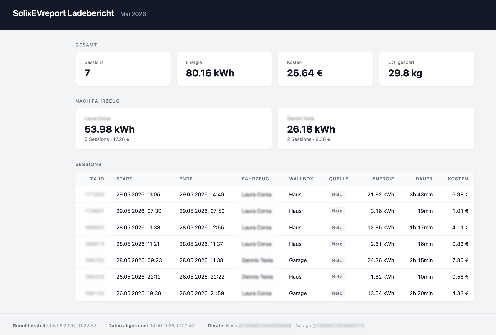

# SolixEVreport

Fetches EV charging sessions from the Anker Solix Wallbox API and generates an HTML report with session statistics, vehicle assignment, and CO₂ savings.



Based on the reverse-engineered Python reference implementation: [thomluther/anker-solix-api](https://github.com/thomluther/anker-solix-api)


## Requirements

- Node.js 18+ (native `fetch` and `crypto` used, no additional runtime dependencies)

## Setup

```bash
npm install
cp .env.example .env   # then fill in your credentials
```

Create a `.env` file with the following variables:

```env
ANKER_EMAIL="your@email.com"
ANKER_PASSWORD="yourpassword"
ANKER_COUNTRY="DE"
ANKER_DEVICE_LABELS="SerialNumber1:Haus,SerialNumber2:Garage"
ANKER_YEAR=2026
ANKER_MONTH=5
```

| Variable | Required | Description |
|---|---|---|
| `ANKER_EMAIL` | ✓ | Anker account email |
| `ANKER_PASSWORD` | ✓ | Anker account password |
| `ANKER_COUNTRY` | | Country code (default: `DE`). Determines EU vs. global API endpoint. |
| `ANKER_DEVICE_LABELS` | ✓ | Comma-separated `SerialNumber:Label` pairs. Serial numbers are used to query the API; labels appear in the report. |
| `ANKER_YEAR` | | Year to report on (e.g. `2026`). Omit for no year filter. |
| `ANKER_MONTH` | | Month to report on (`1`–`12`). Omit or set to `null` for the full year. |

Multiple devices are supported by comma-separating pairs in `ANKER_DEVICE_LABELS`:
```env
ANKER_DEVICE_LABELS="SN1:Haus,SN2:Garage"
```

## Usage

```bash
node index.js
```

This will:
1. Authenticate against the Anker Solix API
2. Fetch all charging sessions for each configured device (paginated, with vehicle info enrichment)
3. Write `report.html` to the project root

## Report

The generated `report.html` contains:

- **Summary** — total sessions, energy (kWh), cost (€), CO₂ saved (kg)
- **By vehicle** — breakdown per registered EV
- **Session table** — transaction ID, start/end time, vehicle, wallbox, charging source (PV or grid), energy, duration, cost
- **Footer** — report generation time, data fetch time, device serial numbers

## Module Structure

```
lib/
  client.js    — HTTP client, EU vs. global API URL selection
  auth.js      — Login (ECDH key exchange + AES-256-CBC password encryption)
  sessions.js  — Session list, detail, and paginated fetch
  vehicles.js  — Vehicle list
  report.js    — HTML report generator
index.js       — Entry point
```
